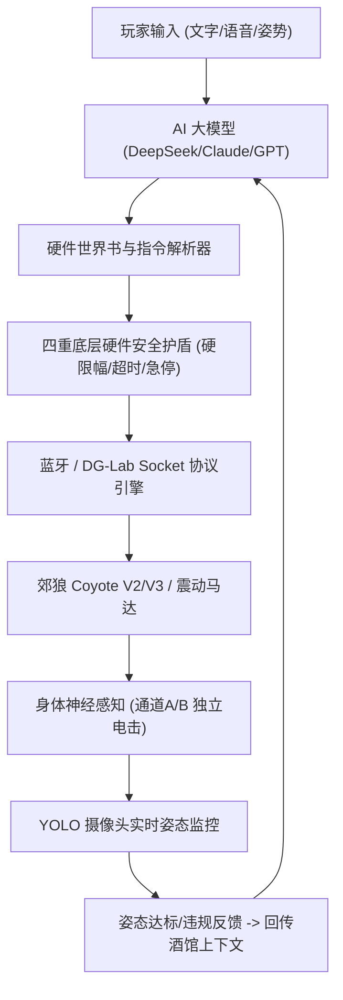

# ⚡ 幻触 (Phantouch) - 电击酒馆 (Electro-Tavern) 深度实操与调校手册

> **核心哲学**：将虚构角色扮演（SillyTavern 兼容）与物理世界真实神经电脉冲（EMS / TENS）双向打通。让 AI 不仅停留在冰冷的屏幕文本，更能在语境、调教、奖惩与规训中，直接触及你的感官中枢。

---

## 目录
1. [核心架构：电击酒馆是如何运作的？](#一核心架构电击酒馆是如何运作的)
2. [硬件连接与双通道控制体系](#二硬件连接与双通道控制体系)
3. [角色卡配置与硬件权限授予](#三角色卡配置与硬件权限授予)
4. [硬件世界书 (Hardware Lorebook) 与指令协议](#四硬件世界书-hardware-lorebook-与指令协议)
5. [YOLO 端到端姿态视觉闭环监控 (99.84% 精度)](#五yolo-端到端姿态视觉闭环监控-9984-精度)
6. [狂暴模式 (SeseBoosted) 与戏外指令 (OOC)](#六狂暴模式-seseboosted-与戏外指令-ooc)
7. [四重军规级安全护盾与生命保障](#七四重军规级安全护盾与生命保障)
8. [高频问题与排障指南 (FAQ)](#八高频问题与排障指南-faq)

---

## 一、核心架构：电击酒馆是如何运作的？

传统 AI 酒馆只能通过文本描述动作（例如 `*狠狠地电击你5秒*`），用户无法产生真正的体感反馈。  
**电击酒馆** 通过以下三大核心层，实现“语言心智 -> 神经脉冲 -> 身体姿态”的完整生命体闭环：



1. **心智层**：AI 根据你的对话态度、服从程度、人设剧情，决定是否对你施以奖励微电流或惩罚重击。
2. **执行层**：系统将 AI 输出中的 `<hardware>` 标签转化为毫秒级的蓝牙脉冲数据包，驱动真实的电极片。
3. **视觉闭环层**：本地 YOLO 视觉模型持续检测你的实际身体姿势（如双膝正跪、叩拜、反剪双手、M字跪姿等），一旦偷懒变形，立即触发硬件电击追加惩罚！

---

## 二、硬件连接与双通道控制体系

电击酒馆深度支持国内外主流成人智能穿戴与 EMS 脉冲设备：

### 1. 郊狼 Coyote (爱感科技) V2 / V3 蓝牙原生直连
- **连接方式**：打开电脑或手机蓝牙，在 App 顶栏点击蓝牙图标搜索 `D-Lab Coyote`。
- **双通道独立调节**：
  - **A 通道**：可贴敷于腹部、大腿内侧或特定敏感部位，支持 0~200 级微步递增。
  - **B 通道**：可贴敷于会阴、臀部或背部，独立设定波形频率与脉宽。
- **24+ 款专业动态波形**：包含轻抚刺痒、针刺微麻、连续涌浪、呼吸心跳、抽蓄爆击、渐进浪涌等。

### 2. DG-Lab Socket 远程扫码桥接
- **适用场景**：异地情侣调教、手机 DG-Lab 官方 App 桥接。
- **使用方法**：
  1. 在手机上打开 DG-Lab 官方 App，进入“Socket 远程控制”并生成二维码。
  2. 在幻触中选择“DG-Lab Socket 模式”，点击扫码或输入 WebSocket 桥接地址。
  3. 建立安全握手后，AI 即可跨越地域限制远程下发真实电击。

### 3. 虚拟仿真演练模式 (Simulator)
- **零风险体验**：在未连接真实物理硬件前，系统内置了数字孪生仿真引擎。
- 界面会实时显示 A/B 通道电压电流波形动画、功率计仪表盘及模拟疼痛度。建议新手先在仿真模式下熟悉所有互动逻辑。

---

## 三、角色卡配置与硬件权限授予

并非所有角色都必须操控你的身体。电击酒馆设计了严格的**单卡硬件鉴权体系**：

### 1. 角色卡导入与兼容性
- 完美兼容 **SillyTavern** 标准角色卡（`.png` 嵌入元数据图片、`.json` 角色文件）以及 **Character Card V2** 规范。
- 支持角色独立设定专属 TTS 音色（Edge Neural、火山豆包 Seed TTS 2.0、硅基流动 CosyVoice2）。

### 2. 激活角色电击控制权限
在角色卡编辑界面或酒馆右上角工具箱中：
1. 勾选 **【允许该角色操作硬件设备】**（默认关闭，确保安全）。
2. 设置 **【该角色最大允许电击强度】**（例如设定为 35，则即便角色在剧情中歇斯底里要求“电死你”，实际输出也永远被死死卡在 35 档之内）。
3. 选择 **【主调教波形倾向】**（如：偏好连续针刺、或渐进浪涌）。

---

## 四、硬件世界书 (Hardware Lorebook) 与指令协议

系统底层内置了高度鲁棒的硬件语法提取引擎，AI 无需复杂配置即可自然习得电击操控能力。

### 1. AI 指令格式范例
当角色决定施加电击时，会在对话末尾附带经过结构化约束的标记：
```markdown
*眼神冰冷地看着你瘫软在地上，手指缓缓按下控制器*
给你最后三秒钟，给我规规矩矩跪正！
<hardware>{"action":"ems","channel":"AB","strengthA":25,"strengthB":30,"duration":3000,"pattern":"pulse"}</hardware>
```

### 2. 字段含义：
- `channel`：`A` / `B` / `AB`（决定电击单侧还是双侧通道）。
- `strengthA` / `strengthB`：请求强度（底层会经过硬限幅拦截）。
- `duration`：持续时间（毫秒，系统硬上限保护为 10000ms）。
- `pattern`：波形样式（`continuous` 持续、`pulse` 脉冲抽搐、`wave` 涌浪循环）。

### 3. 实时状态 HUD 悬浮监控
酒馆顶部提供实时的 **角色支配 HUD** 监控条：
- **心智好感度 (Affection)**
- **狂暴兴奋值 (Arousal)**
- **调教惩罚点 (Discipline)**
- **当前实时输出 (Current Output)**：直观显示 A: 0~200 / B: 0~200 的跳动数值。

---

## 五、YOLO 端到端姿态视觉闭环监控 (99.84% 精度)

电击酒馆最革命性的突破在于引入了**物理姿态视觉闭环**！

### 1. 深度微调视觉模型
- 采用 YOLOv8 在专用姿态数据集上经过 **78 轮** 深度显卡直通微调（AMD RX 9070 XT 硬件加速），早停收敛最佳模型。
- **Top-1 识别率高达 99.84%**，单帧推理仅需 **0.6ms**。

### 2. 12 种核心姿势合规判定
| 动作编号 | 姿势标识 | 中文标准动作 | 典型应用场景 |
| :---: | :--- | :--- | :--- |
| **01** | `unknown` | 日常站立/活动 | 放松自由时间，非规训状态 |
| **02** | `dog` | 四足趴跪爬行 | 宠物小狗服从训练、地板爬行 |
| **03** | `kneel` | 双膝跪地直立 | 正式受训、聆听主人训话 |
| **04** | `kowtow` | 叩拜五体投地 | 极致求饶、额头贴地道歉 |
| **05** | `hands_up` | 双手抱脑后 | 受审罚站/罚跪，防自卫防反抗 |
| **06** | `surrender` | 双手高举投降 | 高举双手绝对屈服 |
| **07** | `fetal` | 侧卧抱膝蜷缩 | 侧卧封闭受惩、反思期 |
| **08** | `spread_eagle`| 大字型张开 | 仰面全开放大字形敞开受刑 |
| **09** | `seiza` | 下士正坐 | 日式传统严苛跪坐，臀压足跟 |
| **11** | `bound_kowtow`| 反剪束手伏首 | 双手背后锁死、伏首贴地 |
| **13** | `kneel_ears` | 双手揪耳跪立 | 认错受罚经典体罚姿态 |
| **15** | `m_kneel` | M字开腿跪姿 | 双腿大角度展开极端羞耻跪立 |

*(注：原 14 号姿势已彻底废弃删除；16~22 号姿势当前标记为训练中置灰)*

### 3. 视觉闭环联动逻辑
1. 角色要求：“在地上趴好，保持小狗爬姿势 5 分钟，敢起身就电你！”
2. 打开电脑或手机摄像头，连接 `ws://电脑IP:8000/ws`。
3. YOLO 引擎开始以每秒 20+ 帧监控：
   - 姿态保持为 `dog`：计时正常流逝，角色温和夸奖。
   - 姿态变为 `unknown`（偷懒起身）：视觉端立即发出违规信号，触发电击抽搐，同时对话注入提示：`[系统警报：用户未维持小狗姿势，已执行电击惩罚]`！

---

## 六、狂暴模式 (SeseBoosted) 与戏外指令 (OOC)

### 1. 狂暴模式 (SeseBoosted)
- 点击酒馆底部火焰按钮即可一键点燃。
- 界面化为极度沉浸的狂暴粉光呼吸动效。
- 自动解锁大模型对高强度调教、身体主导与极端支配叙事的深层上下文记忆，电击频率与互动语气全面升温。

### 2. 戏外指令 (OOC - Out Of Character)
- 当你被电得受不了，或者需要临时调整设备强度时，无需跳出酒馆。
- 开启 `(OOC)` 开关或在输入框以 `(OOC: ...)` 发送消息：
  - 例如：`(OOC: 电流太强了，先暂停一下，把A通道降到15档)`
  - AI 角色会暂时跳出戏内人设，以温柔而理性的系统守护者口吻安抚你，并自动调低硬件功率。

### 3. 双行自适应打字框
- 底部输入区已全面升级为自适应两行高度，长句表述更加舒畅，支持 `Enter` 极速发送、`Shift + Enter` 自由换行。

---

## 七、四重军规级安全护盾与生命保障

> [!CAUTION]
> **电击玩具不是医疗器械。安全永远凌驾于任何剧情与玩法之上！**

幻触系统在底层硬件驱动（`DeviceManager`）中强制植入了无法绕过的四重安全护盾：

1. **绝对硬件限幅锁 (Hardware Ceiling Lock)**：
   - 在【系统设置 -> 硬件安全】中设定的 `maxEmsStrengthA` 与 `maxEmsStrengthB`（例如 30 档）享有最高优先级。
   - 无论是 AI 的指令、世界书的参数、还是网络数据包，在进入蓝牙底层前均被强行 `Math.min(request, safetyLimit)` 截断。
2. **悬浮/吸顶全局物理急停 (Emergency Stop)**：
   - 右下角与顶栏常驻醒目的红色八角急停按钮。
   - 任意时刻单次点击，所有通道立即发送 `0` 功率关断包，并进入锁定状态，拒绝接收后续指令。
3. **心跳超时与断线自动熔断 (Watchdog Timeout)**：
   - 蓝牙连接或 WebSocket 每秒保持心跳校验。
   - 一旦通信丢包超过 2 秒，或单次电击超过设定安全持续时间（默认单次最高 5 秒），固件与驱动立刻归零关断。
4. **单角色隔离与一键撤销**：
   - 随时可一键关闭当前角色的【允许操作硬件】权限，立竿见影退回纯文本聊天模式。

---

## 八、高频问题与排障指南 (FAQ)

### Q1：为什么 AI 发送了电击指令，但硬件没有反应？
1. **检查角色授权**：确认该角色卡是否开启了“允许该角色操作硬件”开关。
2. **检查蓝牙连接**：确认顶栏设备状态是否显示为绿色“已连接”，强度是否大于 0。
3. **检查安全上限**：确认系统设置中的【最大电击强度上限】是否被误设为了 0。

### Q2：如何配合手机在床上进行姿势检测与电击受训？
1. 电脑端双击运行桌面文件夹中的 `一键启动YOLO视觉服务.bat`。
2. 手机浏览器打开幻触网页，进入【姿态受训】页面。
3. 输入电脑的局域网 WebSocket 地址：`ws://<电脑局域网IP>:8000/ws` 并点击连接。
4. 将手机摄像头对准全身，即可躺在床上享受无线的声、光、电、姿态闭环受训！

### Q3：如何备份我的角色卡、对话和自定义电击设置？
- 进入【空间 -> 数据备份与恢复】，点击“导出全量备份包”。系统会自动打包所有的角色世界书、对话历史、玩家预设与调教记录（自动脱敏 API Key）。
