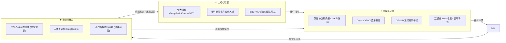

# ⚡ 幻触 (Phantouch) · 电击酒馆 (Electro-Tavern)

<div align="center">

**面向 Android、PWA 与桌面浏览器的本地优先 AI 智控具身交互系统**  
*AI 角色心智 · 神经脉冲 (EMS) 闭环 · YOLO 姿态视觉监控 · 狂暴模式 · 四重安全护盾*

[](./CHANGELOG.md)
[](./scripts)
[](./ELECTRIC_TAVERN_GUIDE.md)
[](./ELECTRIC_TAVERN_GUIDE.md)

</div>

---

> [!IMPORTANT]
> **成人虚构互动与硬件安全警示**  
> 本系统专为具备完全民事行为能力的成年人设计，包含虚构剧情与外部硬件电脉冲驱动能力。硬件操作必须建立在**知情、自愿、可随时物理急停**的前提下进行。使用前请务必仔细阅读 [四重军规级安全护盾](#-四重军规级安全护盾与生命保障) 与 [使用手册](./ELECTRIC_TAVERN_GUIDE.md)。本项目**绝非医疗器械**。

---

## 🌟 核心杀手锏：什么是“电击酒馆”？

传统的 AI 角色扮演酒馆（如 SillyTavern）仅停留在冰冷的屏幕文本描述。  
**幻触 · 电击酒馆** 打破虚实界限，构建了 **“语言心智 ➔ 神经电刺激 (EMS) ➔ 物理姿态监控”** 的跨次元具身闭环：

1. **AI 剧情主导的真实电击**：
   - 兼容 **SillyTavern** 与 **Character Card V2** 角色卡。
   - 角色在剧情对话中根据你的顺从程度或剧情高潮，通过 `<hardware>` 指令直接调度连接的 **郊狼 Coyote V2/V3** 或 **DG-Lab** 硬件，施加真实的双通道（A/B）微安级电脉冲与 24+ 款波形。
2. **YOLO 端到端姿态视觉闭环 (99.84% 准确率)**：
   - 采用最新在 AMD Radeon RX 9070 XT 显卡上微调 **78 轮** 的专用姿态分类引擎。
   - 摄像头实时识别 12 种特定姿态（四足趴跪、双膝跪地、土下座叩拜、反剪束手、M字跪姿等）。
   - 一旦在受训计时中动作变形或偷懒起身，视觉系统将立即下发真实惩罚电击，并在酒馆对话中产生即时剧情警报！
3. **狂暴模式 (SeseBoosted) 与戏外指令 (OOC)**：
   - 点燃狂暴模式，解锁沉浸式粉光律动与极限调教记忆；
   - 任何时刻使用 `(OOC)` 戏外指令，AI 即刻跳出人设温柔安抚并下调设备功率。
4. **两行舒适打字框与晶莹吸底导航栏**：
   - 底部输入区已全面扩充为舒适的双行自适应高度，配合单手优化的扁平晶莹导览栏，触控交互行云流水。

---

## 🧭 系统全景架构



---

## ⚡ 核心功能模块

### 1. 🏰 电击酒馆与角色扮演
- **大模型生态兼容**：无缝直连 DeepSeek、OpenAI、火山方舟、通义千问、Claude、Gemini、OpenRouter、以及本地 Ollama / LM Studio。
- **角色卡生态**：支持导入/导出 SillyTavern PNG、JSON 角色卡与 Character Card V2 世界书；支持 AI 角色工坊辅助创作。
- **长短期记忆与作者注释**：Token 预算制管理长篇巨著级对话，关键规训条目永不遗忘。
- **独立硬件授权**：仅对用户明确打勾授权的角色开启电击权限，并受独立角色最高强度钳制。

### 2. 🔌 智能硬件生态与控制
- **郊狼 Coyote 原生协议**：
  - 支持 **Coyote V2** 与最新 **Coyote V3** 原生蓝牙 GATT 协议。
  - **A/B 双通道完全独立**：可分别配置不同肌肉部位的电流、脉宽与波形。
- **DG-Lab Socket 扫码**：支持与官方 App 远程跨公网联动，异地情侣亦可隔空调教。
- **数字孪生仿真器**：无硬件时提供精美动效、实时示波器与功率拟真。

### 3. 🎯 YOLO 端到端姿态视觉服务 (v1.1.0 重磅)
- **桌面专用一键包**：提供 `一键启动YOLO视觉服务.bat`，开箱即用支持独立显卡硬件加速。
- **12 类支持动作**：
  - `01_unknown` (日常活动) ｜ `02_dog` (四足趴跪) ｜ `03_kneel` (双膝正跪) ｜ `04_kowtow` (五体投地)
  - `05_hands_up` (双手抱头) ｜ `06_surrender` (举手投降) ｜ `07_fetal` (侧卧蜷缩) ｜ `08_spread_eagle` (大字张开)
  - `09_seiza` (下士正座) ｜ `11_bound_kowtow` (反剪伏首) ｜ `13_kneel_ears` (揪耳跪立) ｜ `15_m_kneel` (M字开腿跪)
- *(注：原 14 号姿势已彻底废弃删除；16~22 号姿势当前在前端已安全置灰并标注训练中)*

### 4. 🎙️ 多引擎全能 TTS 与 AI 生图
- **TTS 语音**：集成 Edge Neural、火山豆包 Seed TTS 2.0（24组音色）、硅基流动 CosyVoice2 与 MOSS-TTS。
- **AI 生图**：支持火山通道、硅基流动 Qwen-Image 以及本地 **ComfyUI / WebUI**（自动提取对话核心情境提示词）。

---

## 🛡️ 四重军规级安全护盾与生命保障

为了保证玩家的绝对人身安全，底层代码中强制嵌入了不可绕过的安全防线：

1. **绝对硬件最高限幅锁**：系统设置中设定的 `maxEmsStrengthA/B` 为不可逾越的硬性阈值，任何 AI 指令尝试越界均会被瞬间截断。
2. **全局物理急停机制**：吸顶状态栏与右下角常驻醒目的红色八角急停按钮，轻触瞬间断开一切输出并进入安全锁定。
3. **心跳失联自动熔断**：蓝牙丢包、断网或单次输出超时（超过安全阈值），固件与驱动立刻无条件停机置零。
4. **单角色权限硬隔离**：随时可一键撤销某个角色的硬件访问权，瞬间回归普通纯文本模式。

---

## 🚀 极速上手

### 1. 启动 Web 客户端
```bash
# 1. 安装依赖 (需要 Node.js 22+)
npm ci

# 2. 启动前端开发服务器
npm run dev
```
打开浏览器访问 `http://localhost:3000/` 即可进入幻触控制台。

### 2. 启动 YOLO 视觉服务 (可选)
进入桌面或项目中的 `yolo_server_kit`，双击：
👉 **`一键启动YOLO视觉服务.bat`**  
服务启动后，在 App【姿态受训】页面填入 `ws://127.0.0.1:8000/ws`（手机填入电脑局域网 IP）即可连接。

### 3. Android APK 本地打包
```powershell
npm run build
npx cap sync android
Set-Location android
.\gradlew.bat assembleDebug
```
输出 APK 位于 `android/app/build/outputs/apk/debug/app-debug.apk`。

---

## 📖 详细指南索引

- 📘 [电击酒馆深度实操与调校手册](./ELECTRIC_TAVERN_GUIDE.md) —— *新手必读：从硬件配对、角色卡调教到 YOLO 姿态闭环全攻略*
- 📗 [移动端安装与网络配置指南](./APP_INSTALL_GUIDE.md)
- 📙 [版本更新日志 (Changelog)](./CHANGELOG.md)
- 📕 [GitHub Release 发版说明](./GITHUB_RELEASE.md)

---

## 🧪 质量与测试

本项目拥有严密的工程化测试体系，每次发布均经过全量质量核验：
```bash
npm test
```
* **自动化测试用例**：覆盖硬件协议封包、波形转换、AI 拦截器、急停锁行为、地下城分支与数据持久化等 **132 个单元测试，100% 全部通过**。
* **TypeScript 强类型保证**：编译阶段零错误、零警告。
